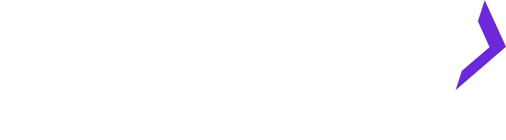

<a name="DPI"></a>

<!-- PROJECT LOGO -->
<br />
<div align="center">
  <a href="https://github.com/r4reetik/dpi">
    
  </a>

  <h3 align="center">DPI</h3>

  <p align="center">
    A secure cross chain smart wallet.
    <br />
    <a href="https://github.com/r4reetik/dpi"><strong>Explore the docs »</strong></a>
    <br />
    <br />
    <a href="https://youtu.be/kym4XXhxJOQ">View Demo</a>
    ·
    <a href="https://github.com/r4reetik/dpi/issues">Report Bug</a>
    ·
    <a href="https://github.com/r4reetik/dpi/issues">Request Feature</a>
  </p>
</div>

<!-- TABLE OF CONTENTS -->

# Table of Contents

  <ol>
    <li>
      <a href="#about-the-project">About The Project</a>
       <ul>
        <li><a href="#security">Security</a></li>
        <li><a href="#signing-data">Signing Data</a></li>
      </ul>
    </li>
    <li><a href="#usage">Usage</a></li>
    <li><a href="#built-with">Built With</a></li>
    <li><a href="#installation">Installation</a></li>
    <li><a href="#usage">Usage</a></li>
    <li><a href="#road-map">Road Map</a></li>
     <li><a href="#acknowledgments">Acknowledgments</a></li>
    
  </ol>

<!-- ABOUT THE PROJECT -->

# About The Project

DPI (yes it's inspired from UPI) stands for decentalized payment interface, it is a non-custodial payment interface for on chain payments.Users are provided with a single DPI ID which hold their assets and it the same for all the EVM based chains(ain't that cool 🤯).Powered by Connext to enable cross chain bridging DPI offers quick and resilient mode of transfers both on the host chain and for payments across chains.Payments are gasless which are verified and submitted through smart wallets.
DPI operates on three layers :

1. Smart wallet contract deployer :
   Smart wallets are deployed via a factory contract which ensures and predetermines the address of the smart wallet contract the user can deploy.
1. Smart wallet contract :
   Smart wallets contain exec() function which is provided with data in the form of user operations which are executed in a single transaction. ECDSASmartWallet is responisble for verifying signature for the data received from the user.The injected provider configured to any chain can be used to sign transactions for any other chain.

1. DPI UX:
   This layer generates data for user operations ,displays data or context , gets them signed by the user and bundles them into a single call.

Polygon - best Defi project(s) , best UX
Deployed Contract links :
Polygon : https://mumbai.polygonscan.com/address/0x0bfe22aACCeEDE01FAa0d24651431Fc2f8cc4437

<p align="right">(<a href="#about-the-project">back to top</a>)</p>

<!-- SECURITY VERIFICATIONS -->

# Security

- The signature verification in smart wallet is efficient and secure.It is verified via the following checks and calculations :

```
address signer = domainSeperator(_sigChainID).toTypedDataHash(
            keccak256(
                abi.encode(_TYPEHASH,
                hash(_userOps),
                nonce(),
                block.chainid,
                _sigChainID)
            )
        ).recover(_sig);
require(state().owner == signer, "ECDSAWallet: failed to verify signature");

```

- Where type hash is given by :

```
bytes32 private constant _TYPEHASH =
        keccak256("ECDSAExec(UserOp[] userOps,uint256 nonce,uint256 chainID,uint256 sigChainID)UserOp(address to,uint256 amount,bytes data)");
```

- Hash function is responsible for generating a aggregated hash via

```
function hash(UserOp[] memory _userOps) internal pure returns (bytes32) {
        bytes32[] memory opHashes = new bytes32[](_userOps.length);
        for (uint i = 0; i < _userOps.length; i++) {
            opHashes[i] = keccak256(abi.encode(UserOp_TYPE_HASH, _userOps[i].to, _userOps[i].amount, keccak256(_userOps[i].data)));
        }
        return keccak256(abi.encodePacked(opHashes));
    }
```

- Where UserOp_TYPE_HASH is given by :

```
    bytes32 private constant UserOp_TYPE_HASH =
        keccak256("UserOp(address to,uint256 amount,bytes data)");
```

### Deterministic Address Generation

- The smart wallet contract address is generated via the following :

```
return address(uint160(uint(keccak256(
                abi.encodePacked(
                    bytes1(0xff),
                    address(this),
                    keccak256(abi.encode(callID, _nonce)),
                    keccak256(abi.encodePacked(
                            type(ERC1967Proxy).creationCode,
                            abi.encode(_impl, _call)
                    )))))));
```

- This ensure that the user receives the generated address as their smart walllet address no matter when the depeploy their contract.
  - Funds can be transfered to address before a contract exists at the address and the funds will be available to the user when the contract is deployed.

The contract implementations can be found in /backend/contracts (https://github.com/r4reetik/dpi/tree/main/backend/contracts)

<p align="right">(<a href="#about-the-project">back to top</a>)</p>

<!--SIGNING DATA -->

# Signing Data

The data display to the user for signing is formatted in the form of :

```
const domain = {
    name: "ECDSAWallet",
    version: "0.0.1",
    chainId: chainID,

    verifyingContract: smartWalletAddress,
  };

  const types = {
    UserOp: [
      { name: "to", type: "address" },
      { name: "amount", type: "uint256" },
      { name: "data", type: "bytes" },
    ],
    ECDSAExec: [
      { name: "userOps", type: "UserOp[]" },
      { name: "nonce", type: "uint256" },
      { name: "chainID", type: "uint256" },
      { name: "sigChainID", type: "uint256" },
    ],
  };

  const value = {
    userOps: userOps,
    nonce: nonce,
    chainID: chainID,
    sigChainID: signatureChainID,
  };

```

<p align="right">(<a href="#about-the-project">back to top</a>)</p>

# Built With

- [![Next][next.js]][next-url]
- [![React][react.js]][react-url]
- [![Connext][connext]][connext-url]
- [![Push Protocol][push]][push-protocol-url]
- [![Covalent][covalent]][covalent-url]

<p align="right">(<a href="#about-the-project">back to top</a>)</p>

# Installation

For both app and backend environment :

1. yarn

<p align="right">(<a href="#about-the-project">back to top</a>)</p>

<!-- USAGE EXAMPLES -->

# Usage

![Architecture Diagram][Architecture]

DPI UX is implemented as a web app which can be used to send and receive payments across chains.As a payments interface it is non-custodial and the user is in full control of their assets.Transfers are the key feature of the app and it is powered by Connext to enable cross chain transfers.Push protocol is used to enable reliable transaction notification.Contracts are deployed on every EVM based chains and the user can deploy smart wallets on any of the supported chains.
The user can :

1. Create a smart wallet at deterministic address.
2. Fnnd the smart wallet with any supported token.
3. Send and receive payments across chains via ENS or public addresses.
4. Use QR code to send and receive payments.

<p align="right">(<a href="#about-the-project">back to top</a>)</p>

<!-- ROADMAP -->

# Road Map

- [x] Desinged and implemented smart wallet and factory contracts
- [x] Added ECDSA verification for smart wallet
- [x] Desined and implemented DPI UX
- [x] Adder support for ERC20 tokens transfer and cross chain transfers
- [x] Added support for qr scanning

Features proposed for future :

- [ ] Add support for generating populated data for all kinds of transactions on UI
- [ ] Add EDDSA signature verification in smart wallets
- [ ] Add compatability support for EIP4337

<p align="right">(<a href="#about-the-project">back to top</a>)</p>

<!-- ACKNOWLEDGMENTS -->

# Acknowledgments

This repo is a part of the project DPI (Decentralized Payment Interface) which is a part of the hackathon hosted by ETHIndia and Devfolio.

<p align="right">(<a href="#about-the-project">back to top</a>)</p>

<!-- MARKDOWN LINKS & IMAGES -->
<!-- https://www.markdownguide.org/basic-syntax/#reference-style-links -->

[product-screenshot]: images/screenshot.png
[next.js]: https://img.shields.io/badge/next.js-000000?style=for-the-badge&logo=nextdotjs&logoColor=white
[next-url]: https://nextjs.org/
[react.js]: https://img.shields.io/badge/React-20232A?style=for-the-badge&logo=react&logoColor=61DAFB
[react-url]: https://reactjs.org/
[connext]: https://img.shields.io/badge/-Connext-green
[connext-url]: https://www.connext.network
[push-protocol-url]: https://push.org
[push]: https://img.shields.io/badge/-Push-yellow
[covalent-url]: https://www.covalenthq.com
[covalent]: https://img.shields.io/badge/-Covalent-blue
[architecture]: images/Architecture.png
